                                              spring学习
# 一：spring 总览
1：准备
  心态：戒骄戒躁  谨慎豁达  如履薄冰
  方法：基础:夯实基础，了解动态->思考：保持怀疑，验证一切->分析：不拘小节，观其大意->实践：思辩结合，学以致用
  工具：JDK1.8  spring源码5.2.2  IDEA   Maven

2:spring特性总览
  注意：(有)代表Java API有一些实现
   核心特性：IOC容器  Spring事件(有)  资源管理(有)  国际化(有)  校验 数据绑定  类型转换   spring表达式   面向切面编程AOP 
   数据存储：JDBC，关系型数据库mybatis   事务抽象(来源于EJB)   DAO支持   O/R映射    XML编列：相当于JAVA的序列化
   Web技术：
            Web Servlet技术栈(spring1-4)：Spring MVC    WebSocket   SockJS
            Web Reactive技术栈(spring5引入)：Spring WebFlux   WebClient   WebSocket 
       Spring MVC和Spring WebFlux在注解上是一样的，底层发生了变化：前者需要Servlet引擎支撑，后者是netty的web server,
       当然后者是可以运用Servlet的引擎实现的。spring3.0以后对WebSocket支持。spring5.0之前有httpClient,同步的，5.0
       之后WebClient，异步回调
  技术整合：远程调用(同步的，Java的RMI，Hession社区开源，Dubbo基于Hession协议)  JAVA消息服务JMS(异步的,ActiveMQ,不包括Kafka,RocketMQ)   
          JAVA连接架构JCA(资源连接，比如JDBC)    JAVA管理扩展JMX(运维)    JAVA邮件客户端email   
          本地任务(单机，利用JAVA多线程)     本地调度(单机，利用java多线程)    缓存抽象   spring测试

3：spring版本特性
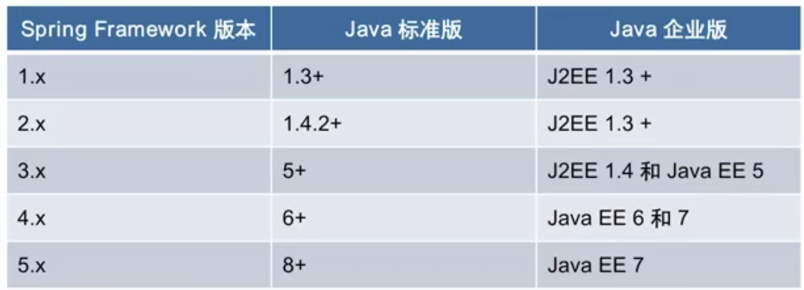

4：spring模块化设计
spring将自己的jar包细分，例如spring-core,spring-context,使得开发人员可以按需分配，达到最小依赖化的原则

5：spring对java语言特性运用
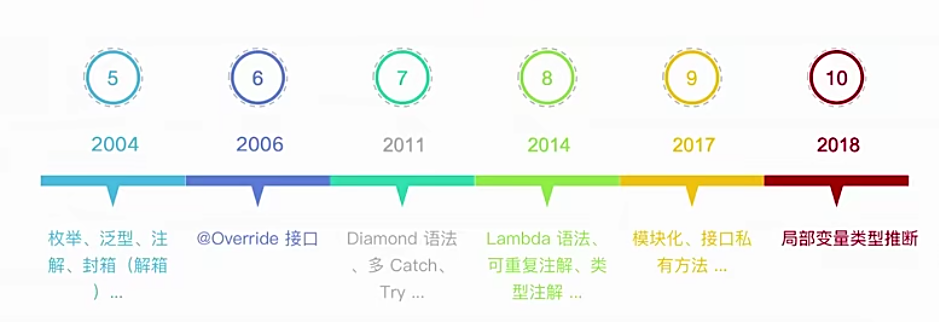
6：spring对JDK API实践

7：spring对JAVA EE API整合

8：spring编程模型
面向对象编程:面向接口
面向切面编程：动态代理,aop
面向元编程：配置文件和注解
函数驱动：函数式编程方式，reactive,lambda
模块驱动：不同实现重点创造不同模块,物理maven,运行时@Enable注解

9：spring核心价值
生态系统：围绕spring有spring boot,spring cloud,spring Security,Spring data以及其他，spring是一个基础
API抽象设计：
编程模型：
设计思想：
设计模式：FoF 23，专属模式，
用户基础：

10：面试题精选
1:什么是spring Framework?（答案来自官网）
Spring使创建Java企业应用程序变得容易。它提供了在企业环境中使用Java语言所需的一切，并支持Groovy和Kotlin作为JVM上的替代语言，
并且可以根据应用程序的需求灵活地创建多种体系结构。从Spring Framework 5.1开始，Spring需要JDK 8+（Java SE 8+），
并提供对JDK 11 LTS的现成支持。建议将Java SE 8更新60作为Java 8的最低修补程序版本，但通常建议使用最新的修补程序版本。
Spring支持广泛的应用程序场景。在大型企业中，应用程序通常存在很长时间，并且必须在升级周期不受开发人员控制的JDK和应用程序服务器上运行。
其他服务器则可以作为单个jar运行，并且服务器可能嵌入云环境中。还有一些可能是不需要服务器的独立应用程序（例如批处理或集成工作负载）。
Spring是开源的。它拥有一个庞大而活跃的社区，可以根据各种实际用例提供持续的反馈。这帮助Spring在很长一段时间内成功地发展了。

2:spring里面有哪些重要的模块？
spring-core:基础API管理，如资源管理，泛型处理
spring-beans：spring bean相关，如依赖查找，依赖注入
spring-sop：spring aop处理，如动态代理，aop字节码提升
spring-context：事件驱动，注解驱动，模块驱动Enable等
spring-expression:spring表达式语言模块

3:spring Framework的优势和不足是什么？


# 二：重新认识IOC(维基百科)
1：IOC发展简介
  反转控制：可以称为好莱坞原则：导演打电话给演员，而不是演员打电话给导演，don not call us,we will call you

2：IOC主要实现策略
  服务定位模式：
  模板方法模式：
  策略模式：这个体现的不是特别深刻
  spring中主要是这两个:
  依赖注入：设值，构造，接口，属性
  依赖查找：上下文查询

3：IOC容器的职责
  依赖处理：依赖查找（主动），依赖注入（大部分是被动，容器做的）   依赖怎么来的，怎么把它返回给客户端
  生命周期管理：容器，托管的资源（Java beans或其他资源，比如监听器,xml）        
  配置：容器，外部化配置（属性配置，xml配置），托管的资源（Java beans或其他资源，如线程池，tomcat）

4：IOC容器的实现
  Java SE :java beans,JNDI(java命名和目录的服务接口) 
  JAva EE: EJB,Servlet
  开源：spring Framework,Apache Avalon,Google Guice

5：传统IOC容器实现
  Java Beans作为IOC容器
  特性：依赖查找，生命周期管理，配置元信息，事件，自定义，资源管理，持久化 
  规范：JavaBeans:原生规范,BeanContext:管理bean,以及Bean之间的相互依赖关系，双亲委派可以用到这里

6：轻量级IOC实现
  方便使用，配置小，代码耦合度小

7：依赖查找VS依赖注入
   依赖查找：beanFactory或者context的getBean()方法，也就是JNDI
   依赖注入：@Autowired @Resource

8：构造器注入vs设值注入
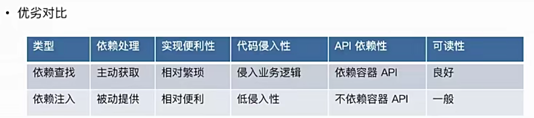

9：面试题精选
1：什么是IOC？
 简单的说，IOC是反转控制：可以称为好莱坞原则，主要有依赖查找和依赖注入

2：依赖查找和依赖注入的区别？
 依赖查找是主动或手动的查找方式，通常需要依赖容器或标准API实现。而依赖注入则是手动或自动依赖绑定的方式，无需依赖特定的容器和API

3：Spring作为IOC容器有什么优势？
 实现了依赖查找及依赖注入两种形式，配置少易使用。其次按需配套了spring事务，aop等其它第三方整合(生态)。


# 三：Spring容器的IOC概述
1：Spring IOC依赖查找
根据Bean名称查找：
实时查找
延迟查找：ObjectFactory，可以通过FactoryBean的实现类ObjectFactoryCreatingFactoryBean
ObjectFactory 通常是针对单类 Bean 做延迟获取的
根据Bean类型查找：单个Bean对象 ,集合Bean对象
根据Bean名称 + 类型查找
根据Java注解查找：单个Bean对象 ,集合Bean对象

2：Spring IOC依赖注入
根据Bean名称注入
根据Bean类型注入
单个Bean对象
集合Bean对象
注入容器內建Bean对象
注入非Bean对象
注入类型
实时注入
延迟注入

3：Spring IOC依赖来源
自定义Bean:xml配置:自定义bean,指的是通过DefaultSingletonBeanRegistry#registerSingleton手动注册的bean。在BeanFactory里面；
容器內建Bean对象：spring帮我们初始化的bean依赖,如Environment、BeanDefinitions 和 Singleton Objects。可以通过getBean获取，用户创建
容器內建依赖：spring内部的依赖,指的是DefaultListableBeanFactory属性resolvableDependencies这个map里面保存的bean,在BeanFactory里面,
           依赖查找时不会去这个map里面找。spring创建

4：Spring IOC配置元信息
Bean定义配置
  基于XML文件
  基于Properties 文件
  基于Java注解
  基于Java AP（专题讨论） 
IoC容器配置
  基于XML文件
  基于Java注解
  基于Java API（专题讨论） 
外部化属性配置
  基于Java注解

5：Spring IOC容器
ApplicationContext是BeanFactory的子接口，说明ApplicationContext is BeanFactory
ApplicationContext 是BeanFactory的包装类，也就是内部组合了BeanFactory的实现-DefaultListableBeanFactory，
ApplicationContext是委托DefaultListableBeanFactory来操作getBean等方法的。
DefaultListableBeanFactory被组合到了AbstractRefreshableApplicationContext，且AbstractRefreshableApplicationContext实现了此接口

6：Spring应用上下文
ApplicationContext不只是是 Bean 容器，而BeanFactory是Bean容器
ApplicationContext 除了 IoC 容器角色，还有提供：
• 面向切面（AOP） 
• 配置元信息（Configuration Metadata） 
• 资源管理（Resources） 
• 事件（Events） 
• 国际化（i18n） 
• 注解（Annotations） 
• Environment 抽象（Environment Abstraction）

7：使用Spring IOC容器
• BeanFactory 是 Spring 底层 IoC 容器
• ApplicationContext 是具备应用特性的 BeanFactory 超集

8：Spring IOC容器生命周期
IoC容器启动（主要阶段）：
1.前期准备工作（记录IoC容器启动时间，校验必要的属性值...）
2.创建一个BeanFactory，注册一些内建的Bean对象或者Bean依赖和内建的非Bean的依赖
3.对BeanFactory进行扩展，通过BeanFactoryPostProcessors 进行操作
4.对Bean的进行扩展，通过BeanPostProcessors 进行操作
5.做一些国际化的资源设置
6.完成一个IoC容器启动事件的广播
IoC容器的停止（主要阶段）：
1.销毁容器里面的所有Bean对象
2.销毁BeanFactory

启动细节：  applicationContext.refresh();
1：BeanNameAware的setBeanName
2：BeanClassLoaderAware的setBeanClassLoader
3：BeanFactoryAware的setBeanFactory
4：EnvironmentAware的setEnvironment
5：EmbeddedValueResolverAware的setEmbeddedValueResolver
6：ResourceLoaderAware的setResourceLoader （仅在在应用程序上下文中运行时适用）
7：ApplicationEventPublisherAware的setApplicationEventPublisher （仅适用于在应用程序上下文中运行的情况）
8：MessageSourceAware的setMessageSource （仅适用于在应用程序上下文中运行的情况）
9：ApplicationContextAware的setApplicationContext （仅适用于在应用程序上下文中运行的情况）
10：ServletContextAware的setServletContext （仅适用于在Web应用程序上下文中运行的情况）
11：BeanPostProcessors的postProcessBeforeInitialization方法
12：InitializingBean的afterPropertiesSet
13：自定义的初始化方法定义
14：BeanPostProcessors的postProcessAfterInitialization方法
销毁细节：applicationContext.close();
1：DestructionAwareBeanPostProcessors的postProcessBeforeDestruction方法
2：DisposableBean的destroy
3：自定义销毁方法定义

9：面试题精选
1:什么是 Spring IoC 容器？
IoC也称为依赖注入（DI）。在此过程中，对象通过构造函数参数，工厂方法的参数或者属性参数返回后在对象实例上设置的属性来定义其依赖。
然后，容器在创建bean时注入那些依赖项。此过程从根本上讲是通过使用类的直接构造或诸如服务定位器模式之类的机制来控制其依赖项的实例化或
位置的bean本身的逆过程（因此称为Control Inversion）。

2：BeanFactory 与 FactoryBean的区别?
BeanFactory 是 IoC 底层容器,bean工厂
FactoryBean 是 创建 Bean 的一种方式，帮助实现复杂的初始化逻辑

3:Spring IoC 容器启动时做了哪些准备？
IoC 配置元信息读取和解析、IoC 容器生命周期、Spring 事件发布、国际化等


# 四：Spring Bean 基础（BeanDefinition接口）
1. 定义 Spring Bean （*）
BeanDefinition 是 Spring Framework 中定义 Bean 的配置元信息接口，包含：
   • Bean 的类名：全限定名称
   • Bean 行为配置元素，如作用域、自动绑定的模式，生命周期回调等
   • 其他 Bean 引用，又可称作合作者（collaborators）或者依赖（dependencies） • 配置设置，比如 Bean 属性（Properties）   

2. BeanDefinition 元信息（*）
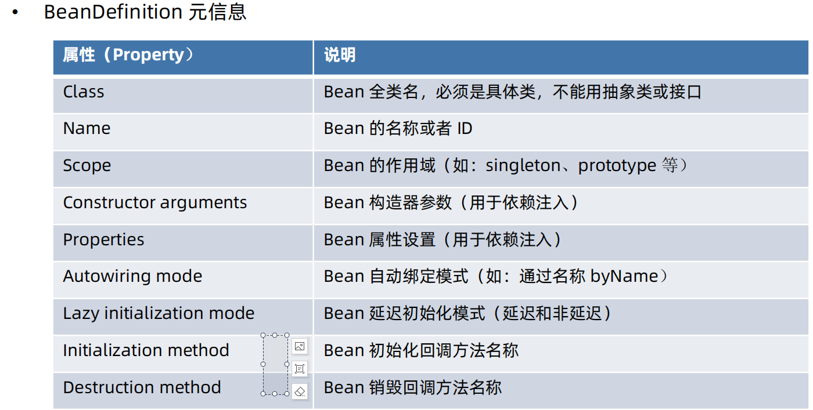
BeanDefinition构建(xml和注解底层都是通过这种方式构建的)：给bean的属性赋值
   • 通过 BeanDefinitionBuilder：AbstractBeanDefinition是BeanDefinitionBuilder的一个属性，其实还是通过AbstractBeanDefinition以及派生类
   • 通过 AbstractBeanDefinition以及派生类，比如GenericBeanDefinition

3. 命名 Spring Bean 
Bean 的名称
   每个 Bean 拥有一个或多个标识符（identifiers），这些标识符在 Bean 所在的容器必须是唯一 的。通常，一个 Bean 仅有一个标识符，
   如果需要额外的，可考虑使用别名（Alias）来扩充。在基于 XML 的配置元信息中，开发人员可用 id 或者 name 属性来规定 Bean 的 标识符。
   通常 Bean 的 标识符由字母组成，允许出现特殊字符。如果要想引入 Bean 的别名的话，可在name 属性使用半角逗号（“,”）或分号（“;”) 来间隔。
   Bean 的 id 或 name 属性并非必须制定，如果留空的话，容器会为 Bean 自动生成一个唯一的名称。Bean 的命名尽管没有限制，
   不过官方建议采用驼峰的方式，更符合 Java 的命名约定。
Bean 名称生成器（BeanNameGenerator接口）（了解） 
   由 Spring Framework 2.0.3 引入，框架內建两种实现：
   • DefaultBeanNameGenerator：默认通用 BeanNameGenerator实现
   • AnnotationBeanNameGenerator：基于注解扫描的BeanNameGenerator实现，起始于Spring Framework 2.5，
   关联的官方文档：
   With component scanning in the classpath, Spring generates bean names for unnamed components,
   following the rules described earlier: essentially, taking the simple class name and turning its initial
   character to lower-case. However, in the (unusual) special case when there is more than one
   character and both the first and second characters are upper case, the original casing gets preserved.
   These are the same rules as defined by java.beans.Introspector.decapitalize (which Spring uses here)
   
4. Spring Bean 的别名
Bean 别名（Alias）的价值
   • 复用现有的 BeanDefinition
   • 更具有场景化的命名方法，比如：
   <alias name="myApp-dataSource" alias="subsystemA-dataSource"/>
   <alias name="myApp-dataSource" alias="subsystemB-dataSource"/>

5. 注册 Spring Bean：将装配好的bean注册到容器中（*）
BeanDefinition 注册
   • XML 配置元信息
      <bean name=”...” ... />
   • Java 注解配置元信息
      @Bean
      @Component
      @Import
   • Java API 配置元信息
      命名方式：BeanDefinitionRegistry#registerBeanDefinition(String,BeanDefinition)
      非命名方式：BeanDefinitionReaderUtils#registerWithGeneratedName(AbstractBeanDefinition,BeanDefinitionRegistry)
      配置类方式：AnnotatedBeanDefinitionReader#register(Class...)
```java
public class AnnotationBeanDefinitionDemo {
    public static void main(String[] args) {
        // 创建 BeanFactory 容器
        AnnotationConfigApplicationContext applicationContext = new AnnotationConfigApplicationContext();
        // 注册 Configuration Class（配置类）
        applicationContext.register(AnnotationBeanDefinitionDemo.class);
        
        // 通过 BeanDefinition 注册 API 实现
        // 1.命名 Bean 的注册方式
        registerUserBeanDefinition(applicationContext, "mercyblitz-user");
        // 2. 非命名 Bean 的注册方法
        registerUserBeanDefinition(applicationContext);

        // 启动 Spring 应用上下文
        applicationContext.refresh();
        // 按照类型依赖查找
        System.out.println("Config 类型的所有 Beans" + applicationContext.getBeansOfType(Config.class));
        System.out.println("User 类型的所有 Beans" + applicationContext.getBeansOfType(User.class));
        // 显示地关闭 Spring 应用上下文
        applicationContext.close();
    }

    public static void registerUserBeanDefinition(BeanDefinitionRegistry registry, String beanName) {
        BeanDefinitionBuilder beanDefinitionBuilder = genericBeanDefinition(User.class);
        beanDefinitionBuilder
                .addPropertyValue("id", 1L)
                .addPropertyValue("name", "小马哥");
        // 判断如果 beanName 参数存在时
        if (StringUtils.hasText(beanName)) {
            // 注册 BeanDefinition
            registry.registerBeanDefinition(beanName, beanDefinitionBuilder.getBeanDefinition());
        } else {
            // 非命名 Bean 注册方法
            BeanDefinitionReaderUtils.registerWithGeneratedName(beanDefinitionBuilder.getBeanDefinition(), registry);
        }
    }

    public static void registerUserBeanDefinition(BeanDefinitionRegistry registry) {
        registerUserBeanDefinition(registry, null);
    }

    @Data
    public class User {
        private Long id;

        private String name;
    }
}
```
   • 外部单例对象注册:bean的生命周期并不由spring管理，但是也可以托管
      Java API 配置元信息
      SingletonBeanRegistry#registerSingleton
```java
public class SingletonBeanRegistrationDemo {

    public static void main(String[] args) throws InterruptedException {
        // 创建 BeanFactory 容器
        AnnotationConfigApplicationContext applicationContext = new AnnotationConfigApplicationContext();
        
        // 创建一个外部 UserFactory 对象,注册外部单例对象
        UserFactory userFactory = new DefaultUserFactory();
        SingletonBeanRegistry singletonBeanRegistry = applicationContext.getBeanFactory();
        singletonBeanRegistry.registerSingleton("userFactory", userFactory);
        
        // 启动 Spring 应用上下文
        applicationContext.refresh();
        // 通过依赖查找的方式来获取 UserFactory
        UserFactory userFactoryByLookup = applicationContext.getBean("userFactory", UserFactory.class);
        System.out.println("userFactory  == userFactoryByLookup : " + (userFactory == userFactoryByLookup));
        // 关闭 Spring 应用上下文
        applicationContext.close();
    }

}
```

6. 实例化 Spring Bean
Bean 实例化（Instantiation） 
• 常规方式
   • 通过构造器（配置元信息：XML、Java 注解和 Java API ） 
   • 通过静态工厂方法（配置元信息：XML 和 Java API ）
```XML
    <bean id="user-by-static-method" class="org.geekbang.thinking.in.spring.ioc.overview.domain.User"
          factory-method="createUser"/>
```
```java
@Data
public class User {
    private Long id;
    private String name;
    
    public static User createUser(){
        return  new User();
    }
}
```
   • 通过 Bean 工厂方法（配置元信息：XML和 Java API ）
```java
public interface UserFactory {

    default User createUser() {
        return User.createUser();
    }
}
```
```xml
    <bean id="userFactory" class="org.geekbang.thinking.in.spring.bean.factory.DefaultUserFactory"/>
    <!-- 实例（Bean）方法实例化 Bean -->
   <bean id="user-by-instance-method" factory-bean="userFactory" factory-method="createUser"/>
```
   • 通过 FactoryBean（配置元信息：XML、Java 注解和 Java API ） 
```java
public class UserFactoryBean implements FactoryBean {

    @Override
    public Object getObject() throws Exception {
        return User.createUser();
    }

    @Override
    public Class<?> getObjectType() {
        return User.class;
    }
}
```
```xml
   <!-- FactoryBean实例化 Bean -->
   <bean id="user-by-factory-bean" class="org.geekbang.thinking.in.spring.bean.factory.UserFactoryBean" />
```
• 特殊方式
   • 通过 ServiceLoaderFactoryBean（配置元信息：XML、Java 注解和 Java API ）
        在classpath的META-INF/servives下创建一个文件，名称是某接口的全限定名称，文件无后缀。文件中直接写上接口实现类的全限定名。
        然后使用ServiceLoader相关的api即可实现接口实现类的实例化。
   • 通过 AutowireCapableBeanFactory#createBean(java.lang. Class, int, boolean)
   • 通过 BeanDefinitionRegistry#registerBeanDefinition(String,BeanDefinition)
   
7. 初始化 Spring Bean
   Bean 初始化（Initialization） 
   • @PostConstruct 标注方法:打在一个public void 方法上       ：构造后置
   • 实现 InitializingBean 接口的 afterPropertiesSet()方法   ： 属性填充后
   • 自定义初始化方法                                         ：功能初始化
      • XML 配置：<bean init-method=”init” ... />
      • Java 注解：@Bean(initMethod=”init”)
      • Java API：AbstractBeanDefinition#setInitMethodName(String)
   思考：假设以上三种方式均在同一 Bean 中定义，那么这些方法的执行顺序是怎样？
   @PostConstruct > 实现 InitializingBean 接口的 afterPropertiesSet()方法 >自定义初始化方法

8. 延迟初始化 Spring Bean
Bean 延迟初始化（Lazy Initialization）：返回的是一个代理对象，真实的对象才被调用的时候才会被初始化。 
     • XML 配置：<bean lazy-init=”true” ... />
     • Java 注解：@Lazy(true)
   思考：当某个 Bean 定义为延迟初始化，那么，Spring 容器返回的对象与非延迟的对象存在怎样的差异？  
     延时初始化：spring上下文初始化完成后，再去按需初始化Bean
     实时初始化：Bean的初始化在spring的上下文初始化之前就已经完成

9. 销毁 Spring Bean
Bean 销毁（Destroy）: applicationContext.close()方法触发  
   • @PreDestroy 标注方法：JAVA GC之后执行
   • 实现 DisposableBean 接口的 destroy() 方法
   • 自定义销毁方法
      • XML 配置：<bean destroy=”destroy” ... />
      • Java 注解：@Bean(destroy=”destroy”)
      • Java API：AbstractBeanDefinition#setDestroyMethodName(String)
   思考：假设以上三种方式均在同一 Bean 中定义，那么这些方法的执行顺序是怎样？
   @PreDestroy > DisposableBean > 自定义销毁方法
   
10. 垃圾回收 Spring Bean
Bean 垃圾回收（GC）
  1. 关闭 Spring 容器（应用上下文）
  2. 执行 GC
  3. Spring Bean 覆盖的 finalize() 方法被回调  

11. 面试题精选
1：如何注册一个 Spring Bean？
    1:BeanDefinition：xml,注解，JAVA API
    2:SingletonBeanRegistry接口的registerSingleton()方法
    
2：什么是 Spring BeanDefinition？

3：Spring 容器是怎样管理注册 Bean


# 五：Spring IOC的依赖查找
1. 依赖查找的今世前生
 单一类型依赖查找：
   • JNDI -javax.naming.Context#lookup(javax.naming.Name)
   • JavaBeans-java.beans.beancontext.BeanContext接口的实现类
 集合类型依赖查找：
   • java.beans.beancontext.BeanContext接口的实现类
 层次性依赖查找：
   • java.beans.beancontext.BeanContext接口的实现类
   
2. 单一类型依赖查找   接口 - BeanFactory
   • 根据 Bean 名称查找
      • getBean(String)
      • Spring 2.5 覆盖默认参数：getBean(String,Object...)
   • 根据 Bean 类型查找
      • Bean 实时查找
         • Spring 3.0 getBean(Class)
         • Spring 4.1 覆盖默认参数：getBean(Class,Object...)
      • Spring 5.1 Bean 延迟查找
         • getBeanProvider(Class)
             ObjectProvider<String> objectProvider = applicationContext.getBeanProvider(String.class);
             String object = objectProvider.getObject();
         • getBeanProvider(ResolvableType)
   • 根据 Bean 名称 + 类型查找：getBean(String,Class)
   
3. 集合类型依赖查找  接口 - ListableBeanFactory
   ListableBeanFactory可以通过某个类型去查找一个集合的列表，集合列表可能有两种情况，一种是查询Bean的名称、还有一种是查询Bean的实例。
   推荐使用Bean的名称来判断Bean是否存在，通过BeanDefinition和FactoryBean的getClassType进行判断，这种方式可以避免提早初始化Bean，
   产生一些不确定的因素。后者会强制Bean的初始化。
   • 根据 Bean 类型查找
      • 获取同类型 Bean 名称列表:匹配当前类和它的子类型
         • getBeanNamesForType(Class):比较BeanDefination里面的定义和FactoryBeans里的getObjectType()
         • Spring 4.2 getBeanNamesForType(ResolvableType)
      • 获取同类型 Bean 实例列表
         • getBeansOfType(Class) 以及重载方法
   • 通过注解类型查找
      • Spring 3.0 获取标注类型 Bean 名称列表
         • getBeanNamesForAnnotation(Class<? extends Annotation>)
      • Spring 3.0 获取标注类型 Bean 实例列表
         • getBeansWithAnnotation(Class<? extends Annotation>)
      • Spring 3.0 获取指定名称 + 标注类型 Bean 实例
         • findAnnotationOnBean(String,Class<? extends Annotation>)
   
4. 层次性依赖查找  接口 - HierarchicalBeanFactory及其子接口
   • 双亲 BeanFactory：getParentBeanFactory()
   • 层次性查找
      • 根据 Bean 名称查找
         • 基于 containsLocalBean 方法实现
      • 根据 Bean 类型查找实例列表
         • 单一类型：BeanFactoryUtils#beanOfType
         • 集合类型：BeanFactoryUtils#beansOfTypeIncludingAncestors
      • 根据 Java 注解查找名称列表
         • BeanFactoryUtils#beanNamesForTypeIncludingAncestors
   
5. 延迟依赖查找
   延迟查找并非是Bean的延迟加载，跟@Lazy是两码事，ObjectProvider#getxxx 方法 底层还是通过BeanFactory来进行依赖查找的，
   但是在进行依赖查找前，可以制定以下规则，比如Bean找到后，再设置额外的属性，完成一些用户的自定义需求；Bean没有找到，该如何处理
   • org.springframework.beans.factory.ObjectFactory
   • org.springframework.beans.factory.ObjectProvider    继承ObjectFactory
      • Spring 5 对 Java 8 特性扩展
         • 函数式接口
           • getIfAvailable(Supplier) 
           • ifAvailable(Consumer)
      • Stream 扩展 - stream()
   
6. 安全依赖查找
   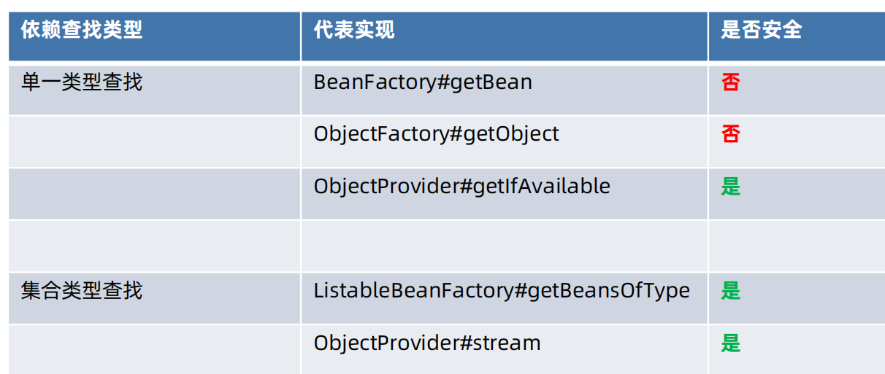
   注意：层次性依赖查找的安全性取决于其扩展的单一或集合类型的 BeanFactory 接口
   
7. 内建可查找的依赖
   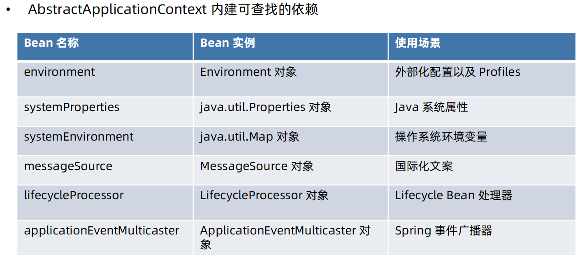
   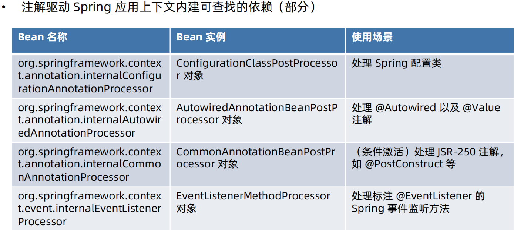
   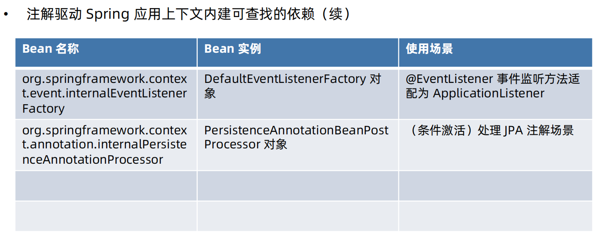

8. 依赖查找中的经典异常
   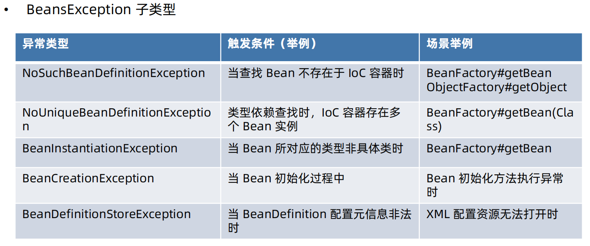
    
9. 面试题精选 
1:ObjectFactory 与 BeanFactory 的区别？
   ObjectFactory 与 BeanFactory 均提供依赖查找的能力。不过 ObjectFactory 仅关注一个或一种类型的 Bean 依赖查找，并且
   自身不具备依赖查找的能力，能力则由 BeanFactory 输出。查看ObjectFactoryCreatingFactoryBean类
   BeanFactory 则提供了单一类型、集合类型以及层次性等多种依赖查找方式。
   
2:BeanFactory.getBean 操作是否线程安全？
  BeanFactory.getBean 方法的执行是线程安全的，超过过程中会增加互斥锁


# 六：Spring IOC的依赖注入
1. 依赖注入的模式和类型
模式:
手动模式 - 配置或者编程的方式，提前安排注入规则
   • XML 资源配置元信息
   • Java 注解配置元信息
   • API 配置元信息(平常开发很少使用，扩展spring容器使用)
自动模式 - 实现方提供依赖自动关联的方式，按照內建的注入规则
   • Autowiring（自动绑定）
   
类型：
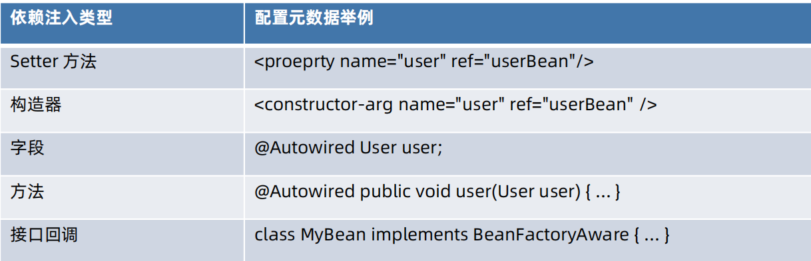

2. 自动绑定（Autowiring）:spring 3.0之后不推荐使用，基本上通过xml使用
   Java里面其实是不是不存在传值引用，都是传值，只不过如果不是基本数据类型的话，传的是内存地址，其实也是值。
• 官方说明
   The Spring container can autowire relationships between collaborating beans. You can let Spring
   resolve collaborators (other beans) automatically for your bean by inspecting the contents of the
   ApplicationContext.
• 优点
   • Autowiring can significantly reduce the need to specify properties or constructor arguments.
   • Autowiring can update a configuration as your objects evolve.
   
3. 自动绑定（Autowiring）模式
   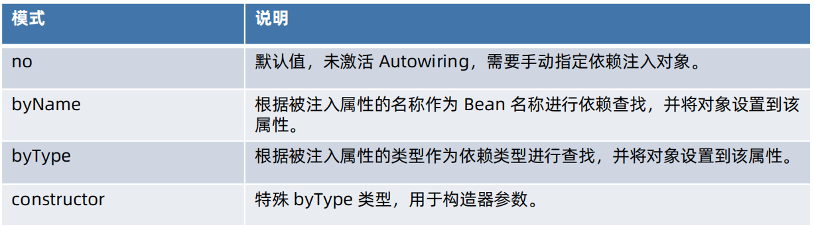 
   注意：如果一个类型对应了几个Bean，出现错误，可以把想注入的bean加上@Primary

4. 自动绑定（Autowiring）限制和不足
官方说明
   Limitations and Disadvantages of Autowiring 小节
   链接：https://docs.spring.io/spring-framework/docs/current/reference/html/core.html#beans-autowired-exceptions
  注意： autowire-candidate 属性是设置当前 Bean 是否为 其他 Bean autowiring 候选者
   
5. Setter 方法依赖注入 
 手动模式
   • XML 资源配置元信息
   • Java 注解配置元信息
   • API 配置元信息
```java
        //创建UserHolder的BeanDefinitionBuilder
        BeanDefinitionBuilder definitionBuilder = BeanDefinitionBuilder.genericBeanDefinition(UserHolder.class);
        //注值 : 给UserHolder的user属性设置引用
        definitionBuilder.addPropertyReference("user", "superUser");
        BeanDefinition beanDefinition=definitionBuilder.getBeanDefinition();
        AnnotationConfigApplicationContext applicationContext = new AnnotationConfigApplicationContext();
        //注册 UserHolder 的 BeanDefinition
        applicationContext.registerBeanDefinition("UserHolder",beanDefinition);
```
 自动模式
   • byName
   • byType
```xml
    <bean class="" autowire="byType">
```
6. 构造器依赖注入
手动模式
   • XML 资源配置元信息
   • Java 注解配置元信息
   • API 配置元信息
自动模式
   • constructor
   
7. 字段注入
手动模式
   • Java 注解配置元信息
      • @Autowired:会忽略掉静态字段,默认byType注入
      • @Resource:默认byName注入
      • @Inject（可选）
   
8. 方法注入
   

9. 回调注入
   

10. 依赖注入类型选择
    

11. 基础类型注入
    

12. 集合类型注入
    

13. 限定注入
    

14. 延迟依赖注入
    

15. 依赖处理过程
    

16. @Autowired 注入原理
    

17. JSR-330 @Inject 注入原理
    

18. Java通用注解注入原理
    

19. 自定义依赖注入注解
    

20. 面试题精选

